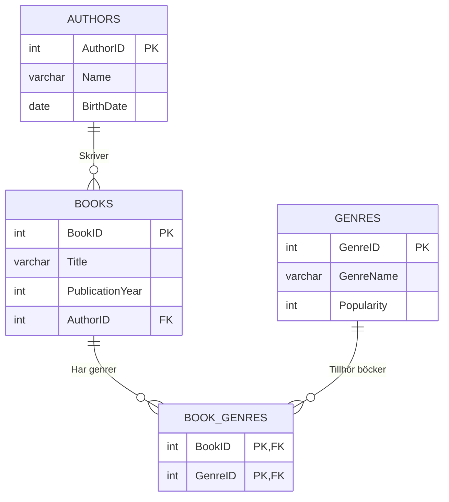

# Uppgift Variant_A

Uppgiftsvariant: A
Betyg: G

## Databasdesign och Implementering

```plaintext
1. Börjar med följande grundschema:
   - Jag skapar databasen "Variant_A" i Kommandotolken.

2. Nya tabellen "Genres" skapas.

   - Data skapades med hjälp av AI för att optimitiera tid och sen infogades till tabeller, så det kan finnas visa data som inte stämmer i verkligheten som till exempel "Popularity" inom "Genrer".

3. Efter att skapa alla data går jag till nästa steg: Analisering av normalisering (1NF):

    - Authors tabell -> Uppfyller 1NF
    - Books tabell -> Uppfyller 1NF
    - Genres tabell -> Uppfyller 1NF

    - Sammanfattning:
        - Varje rad är unik
        - Inga upprepande grupper
        - Alla kolumner är atomära (odelbara värden)

- Analys av 2NF:
      - Authors tabell -> Uppfyller 2NF
      - Books tabell -> Uppfyller 2NF
      - Genres tabell -> Uppfyller 2NF

- Sammanfattning:
        - Inga partiella beroenden.

- Analys av 3NF:
      - Authors tabell -> Uppfyller 3NF
      - Books tabell -> Uppfyller 3NF
      - Genres tabell -> Uppfyller 3NF

- Sammanfattning:
        - Data är helt beroende av PK i varje tabell (Inga transitiva beroenden)

- OBS! Det finns ingen explicit relation mellan tabeller "Books" och "Genres" i datamodellen. En book kan tillhöra flera genrer och en genre kan ha många böcker (many-to-many) -> Lösning -> Kopplingstabellen skapas mellan "Books" och "Genres" -> CREATE TABLE BookGenres.
- Nya diagram skapas med hjälp av Mermaid i json format:
```

### Databasstruktur



- Efter diagram skapades skriver jag SQL-skript för att skapa databasen:

### SQL-Skript

```plaintex
1. Skapa databas

    CREATE DATABASE Variant_A;
    USE Variant_A;`

2. Skapa tabell

    CREATE TABLE Genres (
        GenreID INT NOT NULL PRIMARY KEY,
        GenreName VARCHAR (50) NOT NULL,
        Popularity INT);

    INSERT INTO Genres
    VALUES
    (1, "Deckare", 9),
    (2, "Thriller", 8),
    (3, "Roman", 9),
    (4, "Fantasy", 7),
    (5, "Skräck", 8),
    (6, "Drama", 6),
    (7, "Humor", 5),
    (8, "Äventyr", 6),
    (9, "Ungdomsbok", 8),
    (10, "Dystopi", 7);
```

```sql
`MariaDB [Variant_A]> SELECT * FROM Genres;`
+---------+------------+------------+
| GenreID | GenreName  | Popularity |
+---------+------------+------------+
|       1 | Deckare    |          9 |
|       2 | Thriller   |          8 |
|       3 | Roman      |          9 |
|       4 | Fantasy    |          7 |
|       5 | Skräck     |          8 |
|       6 | Drama      |          6 |
|       7 | Humor      |          5 |
|       8 | Äventyr    |          6 |
|       9 | Ungdomsbok |          8 |
|      10 | Dystopi    |          7 |
+---------+------------+------------+
```

```sql
`CREATE TABLE BookGenres (
    BookID INT NOT NULL,
    GenreID INT NOT NULL,
    PRIMARY KEY (BookID, GenreID)
);

INSERT INTO BookGenres
VALUES
(1,1), (1,2), (2,1), (2,2), (3,1), (4,4), (4,8), (4,9),
(5,2), (5,6), (6,3), (6,6), (6,7), (7,3), (7,10), (8,5),
(8,6), (9,3), (9,7), (10,3), (10,7), (10,8);`

MariaDB [Variant_A]> SELECT * FROM BookGenres;
+--------+---------+
| BookID | GenreID |
+--------+---------+
|      1 |       1 |
|      1 |       2 |
|      2 |       1 |
|      2 |       2 |
|      3 |       1 |
|      4 |       4 |
|      4 |       8 |
|      4 |       9 |
|      5 |       2 |
|      5 |       6 |
|      6 |       3 |
|      6 |       6 |
|      6 |       7 |
|      7 |       3 |
|      7 |      10 |
|      8 |       5 |
|      8 |       6 |
|      9 |       3 |
|      9 |       7 |
|     10 |       3 |
|     10 |       7 |
|     10 |       8 |
+--------+---------+
```

```plaintext
- Här har jag skrivit en exempel om hur man kan använda flera datatyper i en SELECT-fråga.
- JOIN: Kopplar ihop mina tabeller så att man kan se data från alla samtidigt i en stora tabell som visas ned.
- GROUP BY: Gruppera alla rader som har samma kombination av författarenamn, genre, utgivningsår och popularitet.
- ORDER BY:
        1. Sortera efter författarensnamn (A-Ö)
        2. Sortera efter utgivningsår (stigande)
        3. Sortera efter popularitet (fallande - högst först)
```

```sql
`MariaDB [Variant_A]> SELECT Authors.Name AS Författare,
    -> Genres.GenreName AS Genre,
    -> Books.PublicationYear AS Utgivningsår,
    -> Genres.Popularity AS Popularitet
    -> FROM Authors
    -> JOIN Books ON Authors.AuthorID = Books.AuthorID
    -> JOIN BookGenres ON Books.BookID = BookGenres.BookID
    -> JOIN Genres ON BookGenres.GenreID = Genres.GenreID
    -> GROUP BY Authors.Name, Genres.GenreName, Books.PublicationYear, Genres.Popularity
    -> ORDER BY Authors.Name, Books.PublicationYear, Genres.Popularity DESC;` 
    
+-----------------------+------------+---------------+-------------+
| Författare            | Genre      | Utgivningsår  | Popularitet |
+-----------------------+------------+---------------+-------------+
| Astrid Lindgren       | Ungdomsbok |          1973 |           8 |
| Astrid Lindgren       | Fantasy    |          1973 |           7 |
| Astrid Lindgren       | Äventyr    |          1973 |           6 |
| Camilla Läckberg      | Deckare    |          2003 |           9 |
| Camilla Läckberg      | Thriller   |          2003 |           8 |
| Fredrik Backman       | Roman      |          2012 |           9 |
| Fredrik Backman       | Drama      |          2012 |           6 |
| Fredrik Backman       | Humor      |          2012 |           5 |
| Henning Mankell       | Deckare    |          1991 |           9 |
| Jens Lapidus          | Thriller   |          2006 |           8 |
| Jens Lapidus          | Drama      |          2006 |           6 |
| John Ajvide Lindqvist | Skräck     |          2004 |           8 |
| John Ajvide Lindqvist | Drama      |          2004 |           6 |
| Jonas Jonasson        | Roman      |          2009 |           9 |
| Jonas Jonasson        | Äventyr    |          2009 |           6 |
| Jonas Jonasson        | Humor      |          2009 |           5 |
| Katarina Bivald       | Roman      |          2013 |           9 |
| Katarina Bivald       | Humor      |          2013 |           5 |
| Ninni Holmqvist       | Roman      |          2009 |           9 |
| Ninni Holmqvist       | Dystopi    |          2009 |           7 |
| Stieg Larsson         | Deckare    |          2005 |           9 |
| Stieg Larsson         | Thriller   |          2005 |           8 |
+-----------------------+------------+---------------+-------------+
```  

## Stored Procedure

```plaintext

- Store Procedure skapades med hjälp av DBeaver:
```

### SQL Preview

```plaintext
- Sökfunktion som hittar namn av böcker med att skriva själva namnet eller delar av namn.
```

```sql
`CREATE PROCEDURE variant_a.GetBook(in search varchar(50))
begin
    select * from books 
    where title like concat("%", search, "%")
    order by title asc; 

END`
```

### Procedure CALL

```plaintext

- Detta är en exempel hur hittades "En man som heter Ove" med att skriva några ord.
```

```sql
`{ CALL variant_a.GetBook("en") }`

6   En man som heter Ove    2012    6
7   Enhet   2009    7
10  Hundraåringen som klev ut genom fönstret    2009    10
9   Läsarna i Broken Wheel rekommenderar    2013    9
8   Låt den rätte komma in  2004    8
```

## Prestandaanalys

```plaintext
- Originalfråga som ska analyseras med Query Planner:
```

```sql
`MariaDB [Variant_A]> select * from Books where PublicationYear BETWEEN 1990 AND 2005;`
+--------+--------------------------+-----------------+----------+
| BookID | Title                    | PublicationYear | AuthorID |
+--------+--------------------------+-----------------+----------+
|      1 | Män som hatar kvinnor    |            2005 |        1 |
|      2 | Isprinsessan             |            2003 |        2 |
|      3 | Faceless Killers         |            1991 |        3 |
|      8 | Låt den rätte komma in   |            2004 |        8 |
+--------+--------------------------+-----------------+----------+
```

```plaintext
- Query Planner Analys med EXPLAIN:
```

```sql
`MariaDB [Variant_A]> EXPLAIN SELECT * FROM Books WHERE PublicationYear BETWEEN 1990 AND 2005;`
+------+-------------+-------+------+---------------+------+---------+------+------+-------------+
| id   | select_type | table | type | possible_keys | key  | key_len | ref  | rows | Extra       |
+------+-------------+-------+------+---------------+------+---------+------+------+-------------+
|    1 | SIMPLE      | Books | ALL  | NULL          | NULL | NULL    | NULL | 10   | Using where |
+------+-------------+-------+------+---------------+------+---------+------+------+-------------+

MariaDB [Variant_A]>
```

```plaintext
- Flera problem hittades:
      - type: ALL -> Full table scan
      - possible_keys: NULL -> Inga index kan användas
      - key: NULL -> Ingen index används
      - rows: 10 -> Alla rader måste skannas

- Lösning -> Skapa Index på PublicationYear:
```

```sql
`MariaDB [Variant_A]> CREATE INDEX index_publication ON Books(PublicationYear);
Query OK, 0 rows affected (0.026 sec)
Records: 0  Duplicates: 0  Warnings: 0

```

```plaintext

- Analys med EXPLAIN efter index:
```

```sql
`MariaDB [Variant_A]> Explain Select * FROM Books WHERE PublicationYear BETWEEN 1990 AND 2005;`
+------+-------------+-------+-------+-------------------+-------------------+---------+------+------+-----------------------+
| id   | select_type | table | type  | possible_keys     | key               | key_len | ref  | rows | Extra                 |
+------+-------------+-------+-------+-------------------+-------------------+---------+------+------+-----------------------+
|    1 | SIMPLE      | Books | range | index_publication | index_publication | 5       | NULL | 4    | Using index condition |
+------+-------------+-------+-------+-------------------+-------------------+---------+------+------+-----------------------+
```

```plaintext
- Efter att skapa index:
      - Range (index scan) -> istället för full scan
      - Endast 4 av 10 rader skanades
      - Prestanda Optimerad för framtida skalbarhet.

## Användarhantering och Säkerhet

- Loggar in som root:
```

```sql
amena@Antonio:~$ mysql -u root -p
```

```plaintext

- Skapar en ny användare för Variant_A:
```

```sql
`use Variant_A;

CREATE USER 'new_user'@'localhost' IDENTIFIED BY '1234';

```

```plaintext
- Användaren "new_user" fick följande behörigheter: SELECT (läsa data), INSERT (lägga till) och UPDATE (ändra data).
```
  
```sql
`GRANT SELECT, INSERT, UPDATE ON variant_a.* TO 'new_user'@'localhost';

```

```plaintext
- Applicera ändringar:
```

```sql
`MariaDB [(none)]> FLUSH PRIVILEGES;`

`SELECT user, Host
FROM mysql.user;`

PUBLIC
root -> 127.0.0.1
root -> ::1
root -> antonio
mariadb.sys localhost
new_user -> localhost -> "new_user" skapades
root -> localhost
```

```plaintext
- Backup skapades:
```

```sql
 mysqldump -u root Variant_A > Variant_A_backup_$(date +%Y%m%d).sql
```

```plaintext
- Simulerar en databashaveri:
```

```sql
amena@Antonio:~$ mysql -u root -e "CREATE DATABASE Variant_A"
amena@Antonio:~$ mysqldump -u root Variant_A > Variant_A_backup_$(date +%Y%m%d).sql
amena@Antonio:~$ mysql -u root -e "CREATE DATABASE Variant_A_Haveri_Simulering"
mysqldump -u root Variant_A | mysql -u root Variant_A_Haveri_Simulering
amena@Antonio:~$ mysql -u root -e "DROP DATABASE Variant_A_Haveri_Simulering"
MariaDB [(none)]> DROP DATABASE Variant_A;
```

```plain
text
- Återställer databasen från backup:
```

```sql
amena@Antonio:~$ mysql -u root -e "CREATE DATABASE Variant_A"
amena@Antonio:~$ mysql -u root Variant_A < Variant_A_backup_20251127.sql
amena@Antonio:~$ sudo mariadb -u root -p
MariaDB [(none)]> USE Variant_A;
Reading table information for completion of table and column names
You can turn off this feature to get a quicker startup with -A

Database changed
MariaDB [Variant_A]> show tables;
+---------------------+
| Tables_in_Variant_A |
+---------------------+
| Authors             |
| BookGenres          |
| Books               |
| Genres              |
+---------------------+
```

```paintext
OBS! Både mysql och mysqldump begär om lösenord samtidigt och programmet kraschades så jag struntade i -p flagga i kommandon och fortsatt utan lösenord. 
```
